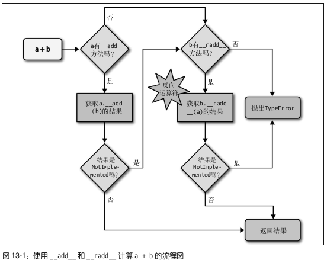

###  流畅的Python笔记

#### Python数据模型

- `数据模型`其实是对 Python 框架的描述,它规范了这门语言自身构建模块的`接口`,这些模块包括但不限于序列、迭代器、函数、类和上下文管理器。

- `collections.namedtuple` 用以构建只有少数属性但是没有方法的类

  ```python
  import collections
  Card = collections.namedtuple('Card', ['rank', 'suit'])
  beer_card = Card('7', 'diamonds')
  beer_card
  ```

- `in`

  > For user-defined classes which define the [`__contains__()`](https://docs.python.org/3/reference/datamodel.html#object.__contains__) method, `x in y` returns `True`if `y.__contains__(x)` returns a true value, and `False` otherwise.
  >
  > For user-defined classes which do not define [`__contains__()`](https://docs.python.org/3/reference/datamodel.html#object.__contains__) but do define [`__iter__()`](https://docs.python.org/3/reference/datamodel.html#object.__iter__), `x in y` is `True` if some value `z` with `x == z` is produced while iterating over `y`. If an exception is raised during the iteration, it is as if [`in`](https://docs.python.org/3/reference/expressions.html#in) raised that exception.
  >
  > Lastly, the old-style iteration protocol is tried: if a class defines [`__getitem__()`](https://docs.python.org/3/reference/datamodel.html#object.__getitem__), `x in y` is `True` if and only if there is a non-negative integer index *i* such that `x == y[i]`, and all lower integer indices do not raise [`IndexError`](https://docs.python.org/3/library/exceptions.html#IndexError) exception. (If any other exception is raised, it is as if [`in`](https://docs.python.org/3/reference/expressions.html#in) raised that exception).

- `a + b`

  

#### 命名空间与作用域

A *scope* is a textual region of a Python program where a namespace is directly accessible.

命名空间

- Local（局部命名空间）
- Global（全局命名空间）
- Built-in（内建命名空间）

作用域

- Local（函数内部）局部作用域
- Enclosing（嵌套函数的外层函数内部）嵌套作用域（闭包）
- Global（模块全局）全局作用域
- Built-in（内建）内建作用域

```python
# test.py
def test():
    print(__file__)
    __file__ = 'test'
    print(__file__)


print(__file__)
__file__ = 'test1'
print(__file__)

test()
```

```python
>>> python test.py
test.py
test1
Traceback (most recent call last):
  File "test.py", line 12, in <module>
    test()
  File "test.py", line 2, in test
    print(__file__)
UnboundLocalError: local variable '__file__' referenced before assignment
```

#### 序列构成的数组

##### 内置序列类型

- 容器序列: 能存放不同类型的数据

  `list` `tuple` `collections.deque`

- 扁平序列: 只能容纳一种类型

  `str` `bytes` `bytearray` `memoryview` `array.array`

> 容器序列存放的是它们所包含的任意类型的对象的引用,而扁平序列里存放的是值而不是引用。

- 可变序列

  `list` `bytearray` `array.array` `collections.deque` `memoryview`

- 不可变序列

  `tuple` `str` `bytes`

##### 列表推导和生成器表达式

- 列表推导不会再有变量泄漏的问题

  ```python
  Python 2.7.6 (default, Mar 22 2014, 22:59:38)
  [GCC 4.8.2] on linux2
  Type "help", "copyright", "credits" or "license" for more information.
  >>> x = 'my precious'
  >>> dummy = [x for x in 'ABC']
  >>> x
  'C'
  ```

  ```python
  >>> x = 'ABC'
  >>> dummy = [ord(x) for x in x]
  >>> x
  'ABC'
  >>> dummy
  [65, 66, 67]
  >>>
  ```

- 生成器表达式
  >生成器表达式背后遵守了迭代器协议,可以逐个地产出元素,而不是先建立一个完整的列表,然后再把这个列表传递到某个构造函数里。
  > 
  > 生成器表达式的语法跟列表推导差不多,只不过把方括号换成圆括号而已。

  ```python
  >>> colors = ['black', 'white']
  >>> sizes = ['S', 'M', 'L']
  >>> for tshirt in ('%s %s' % (c, s) for c in colors for s in sizes):
  ...     print(tshirt)
  ...
  black S
  black M
  black L
  white S
  white M
  white L
  ```
  

##### 元组

- 不可变列表

- 没有字段名的记录

  - `*`运算符把一个可迭代对象拆开作为函数的参数

  ```python
  >>> def test(a, b, c, d):
  ...     print(a, b, c, d)
  ... 
  >>> test(1, *range(2), 3)
  1 0 1 3
  ```

  - 用 `* `来处理剩下的元素

  ```python
  >>> a, *body, c, d = range(5)
  >>> a, body, c, d
  (0, [1, 2], 3, 4)
  >>> *head, b, c, d = range(5)
  >>> head, b, c, d
  ([0, 1], 2, 3, 4)
  ```

  - `collections.namedtuple`

    > The `collections.namedtuple` function is a factory that produces subclasses of tuple enhanced with field names and a class name

  ```python
  >>> from collections import namedtuple
  >>> City = namedtuple('City', 'name country population coordinates')
  >>> tokyo = City('Tokyo', 'JP', 36.933, (35.689722, 139.691667))
  >>> tokyo
  City(name='Tokyo', country='JP', population=36.933, coordinates=(35.689722,
  139.691667))
  >>> tokyo.population
  36.933
  >>> tokyo.coordinates
  (35.689722, 139.691667)
  >>> tokyo[1]
  'JP'
  ```


##### 切片

> `a:b:c` 这种用法只能作为索引或者下标用在 `[]` 中来返回一个切片对象: `slice(a, b, c)`
>
> 对 `seq[start:stop:step]` 进 行 求 值 的 时 候,Python 会 调 用 `seq.__getitem__(slice(start, stop, step))`

#### 字典和集合

